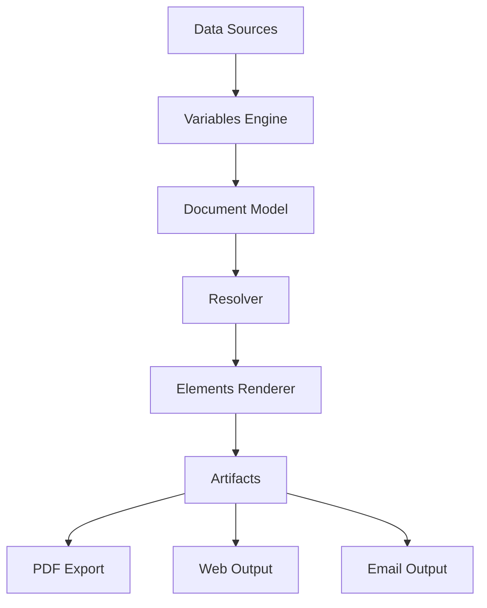

# Elements Studio IDE — Implementation Plan V3 (Approved)

This plan outlines the architectural shift from a "Document Editor" to the **Official IDE for Unlayer Elements**. The primary goal is to build a development environment that makes "build once with Elements, preview and export everywhere" a reality.

## 17 Core Architectural Principles

1. **Variables vs Data Sources:** Strict separation. Data Sources (JSON, API) feed into Variables (key/value), which resolve the Document Model, which feeds Elements to render Artifacts.
2. **Component Library Rendering:** Previews must be rendered dynamically using the Unlayer Elements renderer (with lazy loading and memoization), not static screenshots.
3. **Component Registry:** A central registry (`registry/`) storing metadata (id, name, properties schema, default props, category) for all reusable components to enable drag-and-drop.
4. **Property Schema:** Components expose a schema describing their editable properties. The Right Sidebar Inspector generates itself dynamically from this schema.
5. **Document Model Separation:** Editor State -> Resolver -> Elements Renderer. Rendered HTML is never mutated directly.
6. **Artifact System:** First-class artifact objects (Document, Email, Web). The project supports unlimited artifacts using the same document model.
7. **Render Pipeline:** A dedicated, reusable pipeline: `Editor -> Resolver -> Elements Renderer -> Artifact -> Export`.
8. **Variable Inspector:** Typed variables (String, Color, Image, etc.) with metadata (description, binding count). Clicking a variable shows its usage locations.
9. **Dependency Graph:** Track variable usage (Variable -> Components -> Artifacts) for debugging and optimized selective rerendering.
10. **Component Insertion:** Drag-and-drop metadata allows inserting, nesting, wrapping, and replacing components dynamically.
11. **Multi-Page Support:** Explicit page models (Project -> Artifact -> Pages -> Sections -> Components). Not just one infinite scrolling report.
12. **Theme System:** Strict design tokens mapping (Design Tokens -> Theme -> Component Overrides -> Resolved Styles). No hardcoded colors.
13. **History Operations:** Undo/Redo operates on structural operations (e.g., "Insert Component") rather than just keystrokes.
14. **Performance:** Dependency tracking ensures only components affected by a variable change are re-rendered.
15. **Component Marketplace:** Plugin architecture allowing future npm packages (e.g., `@elements/charts`) to register components automatically.
16. **Documentation:** The architecture must be thoroughly documented using Mermaid diagrams.
17. **Final Product Vision:** A VS Code + Storybook + Figma + Unlayer + React DevTools hybrid, built specifically for Elements.

---

## Execution Phases

### Phase 1: Core IDE Project Structure & Artifact System
- Refactor `useDocumentState.tsx` to `ProjectState`.
- Implement first-class Artifact objects supporting unlimited configurations.
- Update `LeftSidebar.tsx` into a VS Code style explorer with collapsible panels.

### Phase 2: Component Registry & Library Browser
- Create `src/registry` for Component Metadata schemas.
- Build the `ComponentLibrary.tsx` with dynamically rendered Unlayer Elements previews.
- Implement lazy-loading for component previews.

### Phase 3: Variable System Upgrades & Dependency Graph
- Expand the Variable System to support Types (String, Color, Image, Array).
- Build dependency tracking to locate where variables are used.
- Optimize the `LivePreview` to only re-render affected components when a variable changes.

### Phase 4: Dynamic Inspector & Schema Engine
- Create the Property Schema engine.
- Refactor `RightSidebar.tsx` to auto-generate controls based on the selected component's schema.

### Phase 5: Theme Builder & Multi-Page Support
- Implement the Design Token Theme Builder.
- Add Multi-page support to Artifacts.

### Phase 6: Monaco, Split View & Bottom Panel
- Integrate Monaco for JSON editing.
- Build Resizable Split Views (Preview + Code).
- Build the Developer Console (Validation, Render Tree, Output).

---

## Architecture Flow

