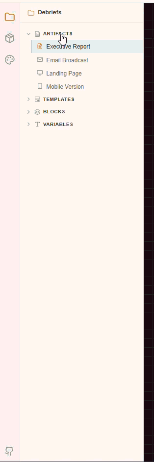
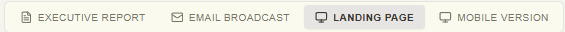
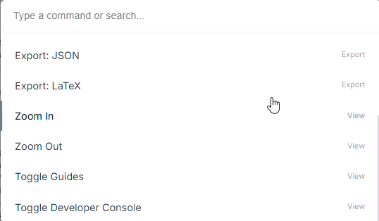
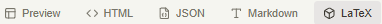

# Debriefs


A premium open-source component library and interactive Studio built on top of [Unlayer Elements](https://github.com/unlayer/elements) for composing beautiful, data-driven executive documents, web landing pages, and email broadcasts.

https://github.com/user-attachments/assets/d3105567-54b4-4ed3-bc10-080cac32af73

---

## 📖 Table of Contents
* [Overview](#overview)
* [How Unlayer Elements Makes It Easier](#how-unlayer-elements-makes-it-easier)
* [How We Used Elements](#how-we-used-elements)
* [Getting Started (How to Run)](#getting-started)
* [How to Edit in the Studio](#how-to-edit-in-the-studio)
* [Templates Overview](#templates-overview)
* [Architecture](#architecture)
* [Acknowledgements](#acknowledgements)

---

## 🌟 Overview

**Debriefs** is not just a template gallery it is a fully functional **Elements Studio** (a mini SaaS app). It demonstrates how developers can compose professional documents using a code first approach with React and TypeScript, and then dynamically edit and preview those documents in real time.

The kit includes a suite of 7 polished templates, a dynamic WYSIWYG inspector, a theme builder, and a robust block-based rendering engine.

---

## 💡 How Unlayer Elements Makes It Easier

Historically, building responsive emails or print ready PDFs required writing archaic, nested HTML `<table>` structures and fighting with email client idiosyncrasies (Outlook, Gmail, etc.). 

**Unlayer Elements** solves this by providing a clean, modern React abstraction. It makes document generation exponentially easier because:

* **No More Nested Tables**: You write modern, semantic React code (`Row`, `Column`, `Heading`). Elements compiles it into bulletproof, email safe HTML under the hood.
* **Write Once, Render Anywhere**: A single React component tree can be rendered flawlessly to an Email Broadcast, a Web Landing Page, or a Print Ready PDF.
* **Developer Experience**: It leverages the React ecosystem. You get full TypeScript type safety, props, state, and component composition. 
* **Zero Runtime Overhead**: It outputs raw, production ready HTML strings via `renderToHtml()` without injecting any React hydration scripts or client side JavaScript.

---

## 🛠️ How We Used Elements

In this project, we heavily rely on Unlayer Elements primitives to construct robust layout blocks:

1. **Primitives**: Every visual component (`Hero`, `ContentBlock`, `Quote`, `Timeline`) is built purely out of Unlayer's `@unlayer/react-elements` exports (e.g., `<Document>`, `<Row>`, `<Column>`, `<Paragraph>`, `<Heading>`, `<Image>`, `<Html>`).
2. **Dynamic Data Binding**: We pass our application state (themes, custom colors, JSON data) directly into Elements as standard React props.
3. **The Rendering Pipeline**: We maintain a JSON representation of our document blocks. Our `LivePreview.tsx` engine maps over these blocks, wraps them in a `<Document>`, and instantly converts them to an iframe-ready preview using:
   ```typescript
   import { renderToHtml } from '@unlayer/react-elements';
   const htmlString = renderToHtml(<MyDocument />);
   ```
4. **Custom Overrides**: For complex components like Charts or Data Tables, we utilize the `<Html>` primitive provided by Elements to seamlessly inject custom CSS grids or SVG charts into the strict Elements layout structure.

---

## 🚀 Getting Started

Follow these steps to run the Elements Studio locally:

### Prerequisites
* Node.js (v18 or higher)
* npm or yarn

### Installation
1. **Clone the repository:**
   ```bash
   git clone https://github.com/your-username/elements-executive-report-kit.git
   cd elements-executive-report-kit
   ```
2. **Install dependencies:**
   ```bash
   npm install
   ```
3. **Start the development server:**
   ```bash
   npm run dev
   ```
4. **Open your browser:** Navigate to `http://localhost:5173` to interact with the Studio.

---

## ✍️ How to Edit in the Studio

The application acts as a complete WYSIWYG editor showcasing the power of Elements.

### 1. Left Sidebar (Navigation & Artifacts)
* **Artifacts**: Switch between different render targets (e.g., Executive Report Document, Email Broadcast, Landing Page). This demonstrates how Elements adapts the same content to different viewports (Desktop, Mobile, A4).
* **Templates**: Swap the core content layout between 7 distinct report types.


<br>


### 2. The Canvas (Live Preview)
* Click on any block (Hero, Timeline, Table) in the center iframe to select it. The preview updates in real time as you type or change colors.

### 3. Right Sidebar (Dynamic Inspector & Theme)
When a block is selected, the **Dynamic Inspector** appears on the right:
* **Content Tab**: Edit the raw JSON data, text fields, and arrays that populate the selected block.
* **Variables**: Inject dynamic variables (e.g., `{{COMPANY_NAME}}`) directly into text fields.
* **Theme Builder**: Click the global "Theme" tab to override brand colors (Primary, Background, Text) and typography (Base Font, Monospace Font). Elements automatically propagates these CSS styles down the tree.


### 4. Command Palette
* Press `Ctrl + K` (or `Cmd + K`) to open the global Command Palette for quick access to templates, export formats (HTML, JSON, Markdown, LaTeX), and zoom controls.



### 5. Export Engine
* Transpile the React Elements Document AST directly into raw **HTML**, **JSON**, **Markdown**, or **LaTeX** with a single click.



---

## 📑 Templates Overview

The kit comes with 7 ready-to-use templates. Each template is a composition of smaller Elements blocks.

### 1. Executive Report
Quarterly performance report designed for C level leadership. Focuses on high level metrics, strategic summaries, and clean typography.


### 2. Research Report
Academic style report for publishing experiments or whitepapers. Features abstract layouts, multi column data, and citation blocks.


### 3. Security Audit
Technical template for vulnerability findings and risk matrices. Includes severity badging and strict tabular layouts.


### 4. Incident Report
Post mortem template containing timelines, root cause analysis blocks, and impact summaries.


### 5. Business Review
Designed for Monthly/Quarterly Business Reviews (MBR/QBR). Heavy emphasis on financial highlights, charts, and operational updates.


### 6. Investor Update
Optimized for email broadcasts to stakeholders. Features a CEO message, fundraising milestones, and a clean single column responsive layout.


### 7. Compliance Report
Structured layout for SOC2 / Framework compliance assessments, policy reviews, and audit trails.


---

## 📁 Architecture

```
elements-executive-report-kit/
├── src/
│   ├── blocks/                # Core block definitions and registry
│   ├── components/            # Reusable @unlayer/react-elements primitives
│   ├── editor/                # React Studio UI (Sidebars, Command Palette)
│   ├── hooks/                 # Global state (useDocumentState context)
│   ├── preview/               # Live iframe renderer using renderToHtml
│   ├── templates/             # Composition of the 7 report layouts
│   └── App.tsx                # Mounts the Studio shell
```

## ❤️ Acknowledgements
A massive thank you to the [Unlayer Elements](https://unlayer.com/elements) team! It was incredibly fun and insightful to work with this library, demonstrating how deeply React can be leveraged to generate pixel-perfect documents and emails effortlessly.

Special thanks to [Eric Della Casa](https://www.linkedin.com/in/eric-della-casa-4262839b/) for introducing me to this amazing opportunity and the Build with Elements Challenge.

## 📜 License
MIT see [LICENSE](LICENSE) for details.

Built for the [Build with Elements Challenge](https://unlayer.com/elements).
